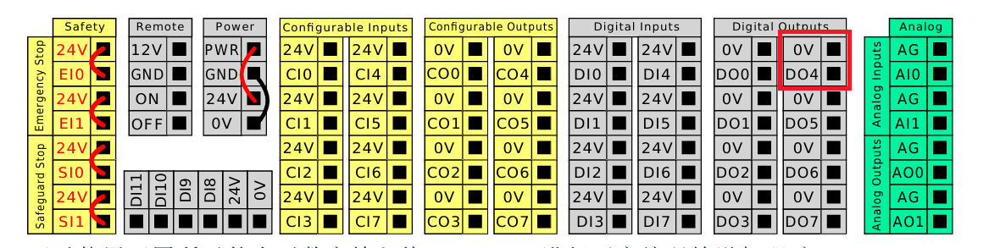
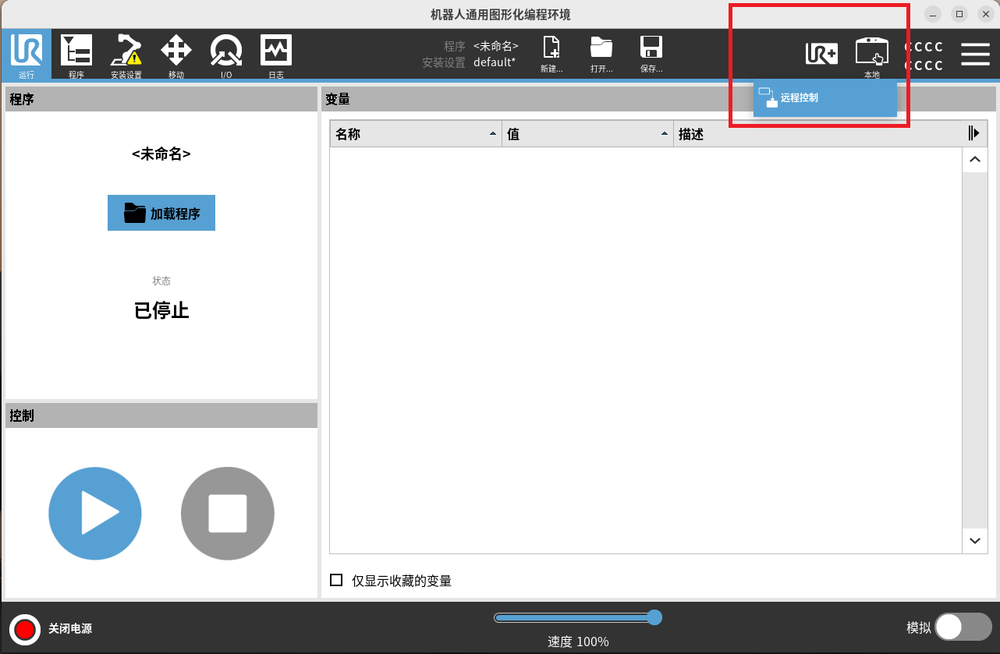

# 优傲机器人端口操作指南【RTDE ROS2】
## 项目简介
本文档专注于 **优傲（UR）机器人** 的核心端口解析、RTDE（实时数据交换）协议应用及 ROS2 集成，实现机器人实时控制与数据交互。
```bash
1135604098@qq.com
Jssvc@183311
```


## 一、官方资源速查
| 资源类型       | 链接/说明                                                                 |
|----------------|--------------------------------------------------------------------------|
| 官方官网       | [优傲机器人中国官网](https://www.universal-robots.cn/)                   |
| 端口定义 | [客户端接口概述](https://www.universal-robots.com/articles/ur/interface-communication/overview-of-client-interfaces/)|
| RTDE 协议指南  | [RTDE 官方教程](https://docs.universal-robots.com/tutorials/communication-protocol-tutorials/rtde-guide.html) |
| RTDE 控制 API  | [RTDE Control Interface API](https://sdurobotics.gitlab.io/ur_rtde/api/api.html#rtde-control-api) |
| ROS2 驱动文档  | [UR ROS2 Driver 官方文档](https://docs.universal-robots.com/Universal_Robots_ROS_Documentation/index.html#) |
| RTDE Python 库 | [RTDE_Python_Client_Library](https://github.com/UniversalRobots/RTDE_Python_Client_Library)|


## 二、UR 机器人核心端口定义
| 端口号  | 官方名称                  | 通信方向 | 核心功能                                                                 | 典型用途                          |
|---------|---------------------------|----------|--------------------------------------------------------------------------|---------------------------------------------------|
| 22      | SSH                       | 双向     | 远程登录机器人 Linux 系统，执行系统命令、查看日志、修改配置               | 机器人系统维护、ROS2 节点远程部署                  |
| 80      | HTTP                      | 双向     | 提供 Web 控制台，配置网络、更新固件、监控设备状态                         | 可视化配置机器人 IP（适配 ROS2 网络）              |
| 102     | Profinet                  | 双向     | 工业以太网协议，与 PLC、传感器等实时交互                                 | 工业场景中 PLC 与 ROS2 系统协同控制               |
| 123     | NTP                       | 单向（入）| 同步系统时钟与 NTP 服务器，确保多设备时间一致性                           | ROS2 分布式节点时间对齐（避免话题时间戳异常）      |
| 502     | Modbus TCP                | 双向     | 读取机器人状态（关节角度、IO）、发送基础控制指令                          | PLC 读取状态并通过 ROS2 话题转发                  |
| **30001**| Real-Time Data Output     | 单向（出）| 主动发送机器人状态数据（关节/ TCP 位姿、IO），不接收指令                 | ROS2 话题 `/ur/state` 数据来源（基础监控）         |
| **30002**| Primary Client Interface  | 双向     | 接收 URScript 控制指令（运动、IO），无执行结果返回                        | ROS2 动作 `/ur/move` 指令下发（无反馈场景）       |
| **30003**| Secondary Client Interface| 双向     | 接收 URScript 并返回执行结果，支持指令验证                               | ROS2 服务 `/ur/get_io_state`（查询 IO 状态）       |
| **30004**| RTDE                      | 双向     | 高频（>100Hz）实时数据交换，可预配置数据项，支持高精度控制               | ROS2 实时控制（视觉引导、力控装配）               |
| 30005   | FTP                       | 双向     | 上传/下载 `.urp` 机器人程序文件                                          | ROS2 系统批量部署机器人程序                        |
| 50001   | Dashboard Server          | 双向     | 远程管理程序（启动/停止/解锁急停），保障操作安全                         | ROS2 服务 `/ur/unlock_emergency_stop`（解除急停） |


## 三、核心端口功能差异对比
### 1. 实时数据类
| 对比维度       | 30001（Real-Time Data Output） | 30004（RTDE）                  |
|----------------|---------------------------------|--------------------------------|
| 通信方向       | 单向（机器人→外部）             | 双向（机器人↔外部）            |
| 数据频率       | ~10Hz（固定）                   | 最高 125Hz（可配置）           |
| 数据灵活性     | 固定数据项（不可自定义）        | 支持预配置数据项（按需选择）   |
| 适用场景       | 基础状态监控（如 ROS2 话题显示） | 高精度实时控制（如视觉引导）   |

### 2. 指令控制类
| 对比维度       | 30002（Primary）                | 30003（Secondary）             |
|----------------|---------------------------------|--------------------------------|
| 执行反馈       | 无（仅执行，不返回结果）        | 有（返回指令执行状态/结果）    |
| 指令验证       | 不支持（错误指令直接忽略）      | 支持（返回错误码）             |
| 适用场景       | 简单控制（如固定轨迹运动）      | 需确认状态的控制（如 IO 检查） |
| ROS2 映射      | 动作 `/ur/move_no_feedback`     | 服务 `/ur/move_with_feedback`  |


## 四、场景化端口选择指南
| 业务需求                     | 推荐端口 | 配套工具/ROS2 接口                  | 优势                                  |
|------------------------------|----------|-------------------------------------|---------------------------------------|
| 仅监控关节/TCP 位姿          | 30001    | ROS2 话题 `/ur/tcp_pose`            | 配置简单，资源占用低                  |
| 控制机器人运动且无需确认结果  | 30002    | ROS2 动作 `/ur/move_l`              | 指令响应快，适合固定流程              |
| 查询 IO 状态或验证指令执行    | 30003    | ROS2 服务 `/ur/query_do_state`      | 结果可验证，避免操作失误              |
| 视觉引导/力控装配（高频）    | 30004    | RTDE Python 库 + ROS2 实时节点      | 125Hz 高频交互，满足精度要求          |
| 远程解锁急停或管理程序        | 50001    | ROS2 服务 `/ur/dashboard/unlock`    | 符合安全规范，支持批量操作            |


## 五、开发环境搭建
### 1. Miniconda 环境
#### 1.1 下载与安装
```bash
# 1. 下载 Miniconda3
# x86_64 架构
wget https://repo.anaconda.com/miniconda/Miniconda3-latest-Linux-x86_64.sh

# aarch64 架构
# wget https://repo.anaconda.com/miniconda/Miniconda3-latest-Linux-aarch64.sh

# 2. 赋予执行权限
chmod +x Miniconda3-latest-Linux-*.sh

# 3. 运行安装脚本
./Miniconda3-latest-Linux-*.sh
```

#### 1.2 安装选项指引
1. 按 `Enter` 阅读协议 → 输入 `yes` 同意；
2. 默认安装路径 `~/miniconda3`（直接按 `Enter`，不建议修改）；
3. 输入 `yes` 初始化 conda（否则 conda 命令无法生效）。

#### 1.3 创建并激活虚拟环境
```bash
# 1. 刷新环境变量（使 conda 命令生效）
source ~/.bashrc

# 2. 验证安装（输出版本号，如 conda 24.5.0）
conda --version

# 3. 接受 conda 条款（创建环境前必做）
conda tos accept --override-channels --channel https://repo.anaconda.com/pkgs/main
conda tos accept --override-channels --channel https://repo.anaconda.com/pkgs/r

# 4. 创建 Python 3.10 环境（适配 RTDE 库）
conda create -n py310 python=3.10 -y

# 5. 激活环境
conda activate py310
```

### 2. RTDE Python 库安装（官方版）
```bash
# 激活 py310 环境
conda activate py310

# 更新 pip 包管理器
pip install --upgrade pip

# 方式1：直接通过 pip 安装（推荐）
pip install git+https://github.com/UniversalRobots/RTDE_Python_Client_Library.git@main

# 方式2：源码安装（需修改源码时用）
git clone https://github.com/UniversalRobots/RTDE_Python_Client_Library.git
cd RTDE_Python_Client_Library
pip install -e .

# 验证安装（运行官方示例，连接 UR 模拟器）
cd examples
python record.py --host localhost --frequency 10
# 成功标志：生成 robot_data.csv 文件（含机器人实时数据）
```


## 六、实操命令集
### 1. 端口状态排查
```bash
# 1. 查看所有监听端口
ss -tuln

# 2. 查看端口对应进程（需 root，定位 UR 核心进程）
sudo ss -tulnp | grep URControl

# 3. 针对性排查目标端口
sudo ss -tulnp | grep 30004

# 4. 查看 ROS2 节点占用的端口（ROS2 集成场景）
ros2 node list
ros2 topic info /ur/tcp_pose  # 查看话题对应的节点与端口
```

### 2. 端口连通性测试
```bash
# 使用 netcat 测试机器人端口
# 测试 30004（RTDE）端口
nc -zv 192.168.1.103 30004
# 测试 50001（Dashboard）端口
nc -zv 192.168.1.103 50001

# 成功提示：Connection to 192.168.1.103 30004 port [tcp/*] succeeded!
# 失败排查：1. 机器人未启动 2. IP 错误 3. 防火墙拦截
```

### 3. 防火墙配置
```bash
# 1. 查看防火墙状态（Ubuntu 默认 ufw）
sudo ufw status

# 2. 配置防火墙
sudo ufw enable  # 开启防火墙
sudo ufw disable # 关闭防火墙

# 3. 开放 UR 核心端口
sudo ufw allow 30004/tcp       # RTDE
sudo ufw allow 50001/tcp       # Dashboard

# 4. 验证开放结果
sudo ufw status numbered
```

### 4. ROS2 实战示例（基于 UR 驱动）
#### 4.2 订阅 RTDE 实时数据（TCP 位姿）
```bash
# 新终端激活环境
source ~/ur_ros2_ws/install/setup.bash

# 订阅 TCP 位姿话题（30004 端口数据）
ros2 topic echo /ur_robot_driver/tcp_pose
```

#### 4.3 发送运动指令（通过 30002 端口）
```bash
# 使用 ROS2 动作发送线性运动指令
ros2 action send_goal /ur_robot_driver/move_line ur_msgs/action/MoveLine "
target_pose:
  pose:
    position:
      x: 0.5
      y: 0.0
      z: 0.3
    orientation:
      x: 1.0
      y: 0.0
      z: 0.0
      w: 0.0
speed: 0.2
acceleration: 0.1
"
```


## 数字输出





## IO 循环控制


## IP 地址


## 远程控制





